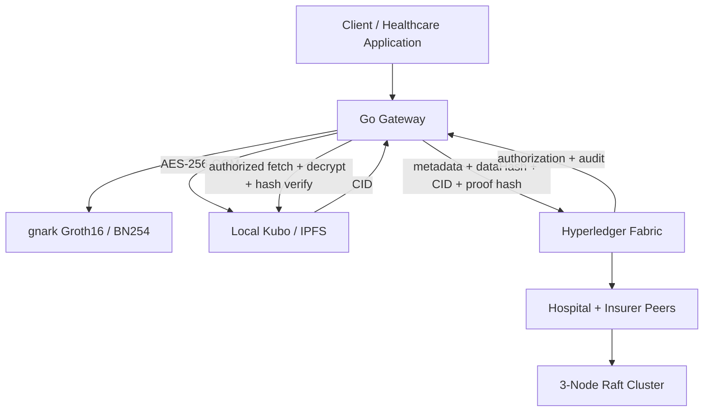

# 🛡️ ZeroTrustBlock — Hyperledger Fabric + ZKP + Encrypted IPFS

[](https://www.hyperledger.org/use/fabric)
[](https://go.dev/)
[](https://nodejs.org/)
[](https://www.docker.com/)
[](LICENSE)

**ZeroTrustBlock** is a privacy-preserving healthcare data-sharing platform combining **Hyperledger Fabric v2.4 LTS**, **Groth16 zero-knowledge proofs**, and optional **AES-256-GCM encrypted IPFS off-chain storage**.

---

## 🌟 Architecture & Security Model

- **Multi-Org Enterprise Topology**: 2 Organizations (`HospitalMSP` & `InsurerMSP`) spanning 4 peer nodes and a 3-node Raft ordering cluster.
- **Off-Chain ZKP Prover/Verifier**: The Go Gateway generates and cryptographically verifies Groth16 proofs (`gnark` BN254) before submitting proof hashes to Fabric. Chaincode enforces the presence of the required proof artifact and evaluates client access policy.
- **Fail-Closed Access Control**: Chaincode validates JSON access policies, authenticated certificate identity (`cid.GetID()`), client MSP identity, role attributes, ZKP requirements, and patient consent status.
- **Immutable On-Chain Audit Logging**: `ReadHealthRecord` is submitted as a Fabric transaction so successful and denied access attempts can generate immutable audit entries.
- **Deterministic Smart Contract**: Chaincode uses Fabric proposal timestamps (`GetTxTimestamp()`) rather than local wall-clock time for ledger state.
- **Multi-Org Endorsement Policy**: Strict `AND('HospitalMSP.member', 'InsurerMSP.member')` policy requires both organizations to endorse health-record writes.
- **Consent Revocation**: Revoked records are denied by chaincode before the authorized Gateway retrieves their off-chain payload.
- **Encrypted IPFS Storage**: When enabled, medical JSON is encrypted with AES-256-GCM before upload. Fabric stores the SHA-256 plaintext hash and `ipfs://<CID>` pointer.
- **Integrity Verification**: Authorized off-chain retrieval decrypts the IPFS object and compares its plaintext SHA-256 against the immutable Fabric `dataHash`.

---

## 🏗 System Topology



---

## 🔐 Encrypted IPFS Off-Chain Storage

IPFS is optional and is **not** the authorization layer. Fabric remains responsible for consent, MSP/role policy, and audit logging.

Start the local Kubo node:

```bash
docker-compose -f docker-compose.ipfs.yml up -d
```

Configure the Gateway with a 32-byte AES-256 key kept outside Git:

```bash
export ZT_IPFS_ENABLED=true
export ZT_IPFS_API_URL=http://127.0.0.1:5001/api/v0
export ZT_IPFS_ENCRYPTION_KEY=$(openssl rand -hex 32)
```

For persistent development use, keep the same key in `.env.local`. `full_reset.sh` loads `.env.local`, reuses the existing key, and persists a newly generated key when one is not present. Changing the key makes previously encrypted IPFS objects undecryptable.

Run the end-to-end integration test after Fabric deployment and identity enrollment:

```bash
cd gateway
source ../.env.local
go run ./cmd/test_ipfs
```

The test exercises:

```text
Gateway
  → Groth16 proof generation + verification
  → AES-256-GCM encryption
  → IPFS upload + CID
  → Fabric metadata transaction
  → Fabric authorization/audit transaction
  → IPFS fetch + decryption
  → SHA-256 integrity verification
  → JSON round-trip verification
```

See [`ipfs/README.md`](ipfs/README.md) for the detailed IPFS design and limitations.

---

## 🔐 Planned ZKP Circuit Design (New Implementation)

The next ZKP implementation will remain within the existing **patient ↔ insurer** healthcare model. The circuits below are planned as real insurance verification primitives rather than demonstration-only proofs.

### 1. `PolicyValidityCircuit`

**Purpose:** Prove that a patient's private claim information satisfies the rules of a specific insurer policy.

**How it will work:** The insurer defines a policy and its public policy identifier/commitment. The patient uses private medical/claim attributes as the witness and proves that the required policy conditions are satisfied without revealing the underlying sensitive values.

### 2. `DiagnosisMembershipCircuit`

**Purpose:** Prove that the patient's diagnosis belongs to the set of diagnoses covered or permitted by the insurer's policy.

**How it will work:** The diagnosis remains private. The insurer publishes a commitment/root for the approved diagnosis set, and the proof demonstrates set membership without disclosing the exact diagnosis code.

### 3. `TreatmentMembershipCircuit`

**Purpose:** Prove that the treatment or procedure associated with a claim is covered by the policy.

**How it will work:** The treatment code remains private while the proof demonstrates membership in the policy's approved treatment/procedure set.

### 4. `ClaimAmountCircuit`

**Purpose:** Prove that the submitted claim amount satisfies the financial constraints of the policy.

**How it will work:** The exact claim amount remains private while the proof establishes an allowed inequality/range such as `claimAmount <= policyLimit` or another policy-defined financial condition.

### 5. `WaitingPeriodCircuit`

**Purpose:** Prove that the required policy waiting period has been satisfied before a treatment/claim becomes eligible.

**How it will work:** Relevant dates remain private and the circuit proves the required relationship between policy activation and treatment/claim dates without revealing the exact dates unless separately required.

### 6. `MedicalHistoryCircuit`

**Purpose:** Prove that relevant medical-history conditions satisfy the policy requirements without exposing the patient's complete medical history.

**How it will work:** Medical history will be represented using commitments/authenticated structures so the circuit can prove the required condition, exclusion, or membership property without revealing the full record.

### 7. `AgeRangeCircuit`

**Purpose:** Prove that the patient's age satisfies a policy-defined eligibility range.

**How it will work:** The exact age remains private while the proof establishes the policy-bound lower and upper age constraints. The policy limits must come from the insurer's policy rather than being freely chosen by the prover.

### 8. `PatientClaimBinding`

**Purpose:** Bind a ZKP to the intended patient, policy, and claim so that a valid proof cannot simply be reused for a different authorization context.

**How it will work:** The circuit will bind private patient knowledge to public commitments/identifiers such as `patientCommitment`, `policyID`/policy commitment, `claimID`, and a suitable freshness value/nonce.

### Planned composition

The final insurance workflow is intended to combine the appropriate primitives above into a policy-bound claim proof:

```text
Patient private data
        ↓
ZKP prover
        ↓
Policy validity
+ diagnosis membership
+ treatment membership
+ claim amount
+ waiting period
+ medical-history condition
+ age condition
+ patient/claim binding
        ↓
Proof π
        ↓
Insurer verifies against policy/claim public inputs
        ↓
VALID / INVALID
        ↓
Hyperledger Fabric records the authorization/audit result
```

This section describes the planned design only; implementation and circuit choices will be added after the circuit specification and security model are finalized.

---

## 📚 ZKP Reference Papers and Implementations

The following works are the main references for the planned ZKP redesign. They are being used as **design references**, not as claims that ZeroTrustBlock reproduces their implementations.

### Zheng, You & Hu (2022) — Medical insurance claims with blockchain + non-interactive ZKP

**Role in this project:** Primary direct reference for the **patient/insurer medical-insurance claim** scenario and privacy-preserving insurance transactions.

**Relevant ideas:** Privacy-preserving insurance purchase/claim processing using blockchain, non-interactive zero-knowledge proofs, and additional cryptographic protection.

### Sanober & Anwar (2026) — ZK-SNARK-enabled health-insurance smart contracts

**Role in this project:** Recent direct reference for **health-insurance claim processing with ZK-SNARKs**.

**Relevant ideas:** Privacy-preserving health-insurance processing and claims using ZK-SNARKs and smart contracts. The reference implementation uses Polygon rather than Hyperledger Fabric, making it useful for comparison rather than direct architectural reuse.

### Bakare et al. (2025) — Blockchain-based health insurance using Zero-Knowledge Proof

**Role in this project:** Reference for privacy-preserving **treatment, appointment, and billing verification** in health insurance.

**Relevant ideas:** Hospital-generated verifiable proofs that allow an insurer to validate required facts without receiving the underlying sensitive healthcare record. This work is primarily a conceptual framework rather than a full production implementation.

### Harpocrates — Privacy-Preserving and Immutable Audit Log for Sensitive Data Operations

**Role in this project:** Strong reference for **ZKP + Hyperledger Fabric + sensitive-data auditability**.

**Relevant ideas:** Zero-knowledge proofs are used to preserve confidentiality while maintaining publicly verifiable validity of sensitive data operations; the system is implemented and evaluated on Hyperledger Fabric.

### PrivChain — Provenance and Privacy Preservation in Blockchain-enabled Supply Chains

**Role in this project:** Reference for **zero-knowledge range proofs and commitment-based privacy**.

**Relevant ideas:** Proving properties of sensitive values, including range-style conditions, without revealing the exact underlying values, while separating proof generation from blockchain verification.

### Additional relevant reference — ZKlaim

**Role in this project:** Useful implementation reference for privacy-preserving medical insurance claims.

**Relevant ideas:** A medical-insurance claim architecture containing components such as policy validity, amount-range checking, doctor attestation, deductible accumulation, and category non-membership. This is particularly useful when selecting practical circuit primitives for the new implementation.

---

## 📊 Benchmarking Breakdown

ZeroTrustBlock includes two distinct benchmark suites:

1. **Go Stress Engine (`benchmark/`)**:
   - Tests end-to-end Gateway ingestion, `gnark` ZKP generation, verification, and Fabric block commits.
   - **Simulation Mode**: Local development harness simulating high-concurrency loads.
   - **Real Mode (`cmd/real/main.go`)**: Direct high-concurrency execution against live Fabric peers.

2. **Hyperledger Caliper Suite (`caliper/`)**:
   - Evaluates peer network saturation and transaction throughput under controlled offered loads.
   - Benchmark results are environment-specific and should be reported with the exact configuration and hardware used.

---

## 📋 Technical Stack & Versioning

- **Fabric Engine**: Hyperledger Fabric `v2.4.9` LTS line.
- **Client SDK**: `github.com/hyperledger/fabric-sdk-go` `v1.0.0`.
- **ZKP Backend**: `github.com/consensys/gnark` `v0.9.1` (Groth16 over BN254).
- **IPFS**: Kubo `v0.43.0` via `ipfs/kubo:v0.43.0`.
- **Encryption**: AES-256-GCM with a 32-byte key supplied through `ZT_IPFS_ENCRYPTION_KEY`.

---

## 🚀 Quick Start

### Start the Fabric network

```bash
chmod +x network.sh deploy.sh full_reset.sh
./network.sh up
./deploy.sh
```

Then provision Gateway identities:

```bash
cd gateway
go run ./cmd/enroll
```

### Full reset + benchmark

```bash
./full_reset.sh
```

The full reset regenerates Fabric crypto material, rebuilds and deploys chaincode, provisions fresh Gateway identities, starts IPFS when enabled, and then runs the real benchmark. It does **not** delete the persistent IPFS Docker volume.

---

## 📁 Repository Structure

```
.
├── benchmark/               # Go stress test harness (Real & Simulation modes)
├── caliper/                 # Hyperledger Caliper benchmark suite
├── chaincode/               # Smart contract and Zero-Trust access logic
├── configtx/                # Network topology & channel profiles
├── crypto-config/           # Generated Fabric identity configuration
├── experiments/             # Reproducible A–E experimental evaluation plan
├── gateway/                 # Fabric Gateway SDK + ZKP + encrypted IPFS integration
├── ipfs/                    # IPFS integration documentation
├── zkp/                     # Groth16 ZKP circuits
├── docker-compose.yml       # Fabric network
├── docker-compose.ipfs.yml  # Optional local Kubo node
├── deploy.sh                # Chaincode lifecycle deployment
├── full_reset.sh            # Full reset + benchmark orchestrator
└── network.sh               # Crypto/artifact/network bootstrapper
```

---

## 🛡️ License

Apache 2.0 License.
