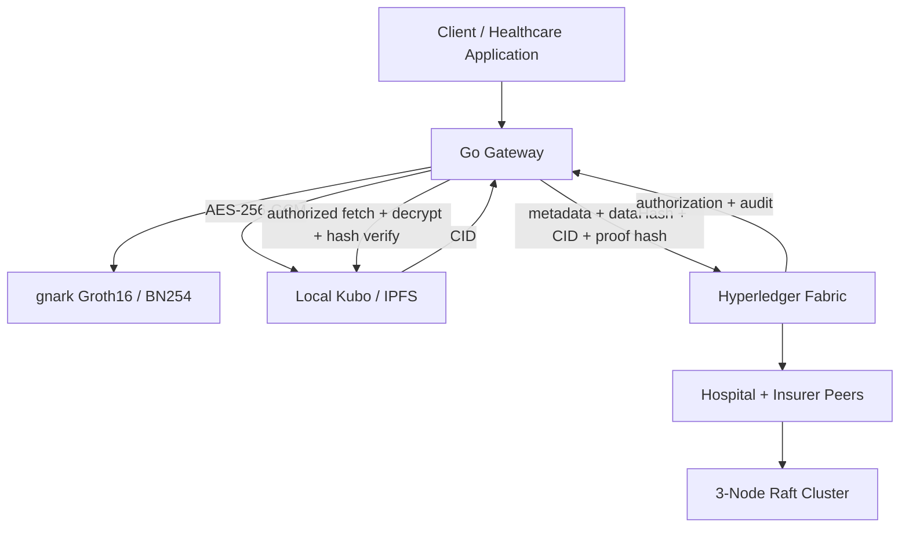

# 🛡️ ZeroTrustBlock — Hyperledger Fabric + ZKP + Encrypted IPFS

[](https://www.hyperledger.org/use/fabric)
[](https://go.dev/)
[](https://nodejs.org/)
[](https://www.docker.com/)
[](LICENSE)

**ZeroTrustBlock** is a privacy-preserving healthcare data-sharing platform combining **Hyperledger Fabric v2.4 LTS**, **Groth16 zero-knowledge proofs**, and optional **AES-256-GCM encrypted IPFS off-chain storage**.

---

## 🌟 Architecture & Security Model

- **Multi-Org Enterprise Topology**: 2 Organizations (`HospitalMSP` & `InsurerMSP`) spanning 4 peer nodes and a 3-node Raft ordering cluster.
- **Off-Chain ZKP Prover/Verifier**: The Go Gateway generates and cryptographically verifies Groth16 proofs (`gnark` BN254) before submitting proof hashes to Fabric. Chaincode enforces the presence of the required proof artifact and evaluates client access policy.
- **Fail-Closed Access Control**: Chaincode validates JSON access policies, authenticated certificate identity (`cid.GetID()`), client MSP identity, role attributes, ZKP requirements, and patient consent status.
- **Immutable On-Chain Audit Logging**: `ReadHealthRecord` is submitted as a Fabric transaction so successful and denied access attempts can generate immutable audit entries.
- **Deterministic Smart Contract**: Chaincode uses Fabric proposal timestamps (`GetTxTimestamp()`) rather than local wall-clock time for ledger state.
- **Multi-Org Endorsement Policy**: Strict `AND('HospitalMSP.member', 'InsurerMSP.member')` policy requires both organizations to endorse health-record writes.
- **Consent Revocation**: Revoked records are denied by chaincode before the authorized Gateway retrieves their off-chain payload.
- **Encrypted IPFS Storage**: When enabled, medical JSON is encrypted with AES-256-GCM before upload. Fabric stores the SHA-256 plaintext hash and `ipfs://<CID>` pointer.
- **Integrity Verification**: Authorized off-chain retrieval decrypts the IPFS object and compares its plaintext SHA-256 against the immutable Fabric `dataHash`.

---

## 🏗 System Topology



---

## 🔐 Encrypted IPFS Off-Chain Storage

IPFS is optional and is **not** the authorization layer. Fabric remains responsible for consent, MSP/role policy, and audit logging.

Start the local Kubo node:

```bash
docker-compose -f docker-compose.ipfs.yml up -d
```

Configure the Gateway with a 32-byte AES-256 key kept outside Git:

```bash
export ZT_IPFS_ENABLED=true
export ZT_IPFS_API_URL=http://127.0.0.1:5001/api/v0
export ZT_IPFS_ENCRYPTION_KEY=$(openssl rand -hex 32)
```

For persistent development use, keep the same key in `.env.local`. `full_reset.sh` loads `.env.local`, reuses the existing key, and persists a newly generated key when one is not present. Changing the key makes previously encrypted IPFS objects undecryptable.

Run the end-to-end integration test after Fabric deployment and identity enrollment:

```bash
cd gateway
source ../.env.local
go run ./cmd/test_ipfs
```

The test exercises:

```text
Gateway
  → Groth16 proof generation + verification
  → AES-256-GCM encryption
  → IPFS upload + CID
  → Fabric metadata transaction
  → Fabric authorization/audit transaction
  → IPFS fetch + decryption
  → SHA-256 integrity verification
  → JSON round-trip verification
```

See [`ipfs/README.md`](ipfs/README.md) for the detailed IPFS design and limitations.

---

## 📊 Benchmarking Breakdown

ZeroTrustBlock includes two distinct benchmark suites:

1. **Go Stress Engine (`benchmark/`)**:
   - Tests end-to-end Gateway ingestion, `gnark` ZKP generation, verification, and Fabric block commits.
   - **Simulation Mode**: Local development harness simulating high-concurrency loads.
   - **Real Mode (`cmd/real/main.go`)**: Direct high-concurrency execution against live Fabric peers.

2. **Hyperledger Caliper Suite (`caliper/`)**:
   - Evaluates peer network saturation and transaction throughput under controlled offered loads.
   - Benchmark results are environment-specific and should be reported with the exact configuration and hardware used.

---

## 📋 Technical Stack & Versioning

- **Fabric Engine**: Hyperledger Fabric `v2.4.9` LTS line.
- **Client SDK**: `github.com/hyperledger/fabric-sdk-go` `v1.0.0`.
- **ZKP Backend**: `github.com/consensys/gnark` `v0.9.1` (Groth16 over BN254).
- **IPFS**: Kubo `v0.43.0` via `ipfs/kubo:v0.43.0`.
- **Encryption**: AES-256-GCM with a 32-byte key supplied through `ZT_IPFS_ENCRYPTION_KEY`.

---

## 🚀 Quick Start

### Start the Fabric network

```bash
chmod +x network.sh deploy.sh full_reset.sh
./network.sh up
./deploy.sh
```

Then provision Gateway identities:

```bash
cd gateway
go run ./cmd/enroll
```

### Full reset + benchmark

```bash
./full_reset.sh
```

The full reset regenerates Fabric crypto material, rebuilds and deploys chaincode, provisions fresh Gateway identities, starts IPFS when enabled, and then runs the real benchmark. It does **not** delete the persistent IPFS Docker volume.

---

## 📁 Repository Structure

```
.
├── benchmark/               # Go stress test harness (Real & Simulation modes)
├── caliper/                 # Hyperledger Caliper benchmark suite
├── chaincode/               # Smart contract and Zero-Trust access logic
├── configtx/                # Network topology & channel profiles
├── crypto-config/           # Generated Fabric identity configuration
├── experiments/             # Reproducible A–E experimental evaluation plan
├── gateway/                 # Fabric Gateway SDK + ZKP + encrypted IPFS integration
├── ipfs/                    # IPFS integration documentation
├── zkp/                     # Groth16 ZKP circuits
├── docker-compose.yml       # Fabric network
├── docker-compose.ipfs.yml  # Optional local Kubo node
├── deploy.sh                # Chaincode lifecycle deployment
├── full_reset.sh            # Full reset + benchmark orchestrator
└── network.sh               # Crypto/artifact/network bootstrapper
```

---

## 🛡️ License

Apache 2.0 License.
